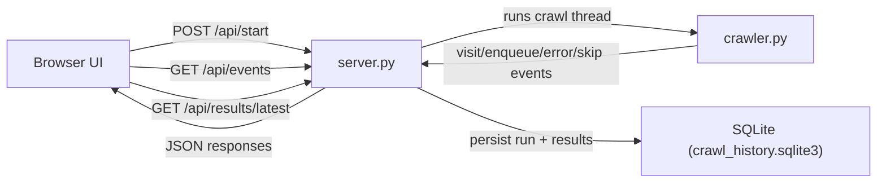

# Web Crawler Live

`Web Crawler Live` is a beginner-friendly Python web crawler with a real-time dashboard.

It can:
- crawl a website using breadth-first search (BFS),
- respect `robots.txt`,
- show live crawl events in the UI,
- store completed crawl output in SQLite,
- and export crawl output to JSON/CSV from CLI mode.

The project uses only Python standard library modules (no external Python packages required).

## Who This Is For

This project is useful if you are learning:
- how crawling works (queues, depth, visited set),
- how a backend and frontend communicate using JSON APIs,
- and how to persist run results in SQLite.

## Features

- Real-time crawl control panel (start URL, depth, limits, delay, timeout)
- Live event stream (`start`, `visit`, `enqueue`, `skip`, `error`, `complete`)
- Crawl stats (visited/queued/errors/skipped/max depth)
- SQLite persistence:
  - `crawl_runs` (run metadata + aggregate stats)
  - `crawl_results` (per-page output)
- Stored output table in UI after crawl completion
- CLI mode with optional `--json-out` and `--csv-out`

## Tech Stack

- Backend: Python 3 standard library (`http.server`, `urllib`, `sqlite3`, `threading`)
- Frontend: HTML + CSS + vanilla JavaScript
- Storage: SQLite (`crawl_history.sqlite3` in project root)

## Project Structure

```text
web-crawler-live/
  README.md
  __init__.py
  crawler.py              # Core BFS crawler logic
  server.py               # HTTP server + APIs + SQLite persistence
  crawl_history.sqlite3   # Auto-created database file after server runs
  ui/
    index.html            # Main dashboard UI
    static/
      app.js              # UI logic (polling, rendering events/results)
      style.css           # Styling
```

## Architecture (Design Overview)



### How a Crawl Works End-to-End

1. You click **Launch Crawl** in the browser.
2. UI sends crawl settings to `POST /api/start`.
3. Server starts a background thread and runs `crawl(...)`.
4. Crawler fetches pages, extracts links, and emits events.
5. UI polls `GET /api/events` and updates live metrics/stream.
6. When crawl finishes, server writes final run + page rows to SQLite.
7. UI calls `GET /api/results/latest` and renders stored output table.

## Installation

### 1) Prerequisites

- Python 3.9+
- macOS/Linux terminal (commands below use `python3`)

Verify:

```bash
python3 --version
```

### 2) Clone / Enter Project

```bash
git clone <your-repo-url>
cd web-crawler-live
```

No `pip install` step is required.

## Run the Project (UI Mode)

From project root:

```bash
python3 -c "import os,sys,types,importlib.util; pkg=types.ModuleType('web_crawler_live'); pkg.__path__=[os.getcwd()]; sys.modules['web_crawler_live']=pkg; spec=importlib.util.spec_from_file_location('web_crawler_live.server', os.path.join(os.getcwd(),'server.py')); mod=importlib.util.module_from_spec(spec); sys.modules['web_crawler_live.server']=mod; spec.loader.exec_module(mod); mod.main()"
```

Open:

- `http://127.0.0.1:8000`

What happens on first run:
- SQLite DB is initialized automatically.
- File created: `crawl_history.sqlite3`

## How to Use the UI

1. Enter a start URL (for example, `https://example.com`).
2. Set limits (`Max Pages`, `Max Depth`) and request options.
3. Click **Launch Crawl**.
4. Watch:
   - Activity Stream (live events)
   - Metrics cards
   - Stored Output table (loaded from SQLite after completion)

## API Endpoints

- `POST /api/start`
  - Starts a new crawl with JSON payload (start URL, limits, options).
- `GET /api/events?after=<id>`
  - Returns incremental live events + session state.
- `GET /api/state`
  - Returns current in-memory crawl session state.
- `GET /api/results/latest`
  - Returns latest completed run metadata and stored page rows from SQLite.

## CLI Mode (Optional)

Run crawler directly and print results in terminal:

```bash
python3 crawler.py https://example.com --max-pages 20 --max-depth 2
```

Export to files:

```bash
python3 crawler.py https://example.com --json-out crawl.json --csv-out crawl.csv
```

## Database Schema (Summary)

- `crawl_runs`
  - one row per crawl execution
  - includes timings, settings, final status, aggregate counters
- `crawl_results`
  - one row per visited page
  - fields: `url`, `status`, `content_type`, `depth`

## Important Notes

- The crawler respects `robots.txt` by default.
- You can disable robots handling from UI or with CLI `--ignore-robots`.
- Crawling large domains can generate many requests quickly; keep delays and page limits responsible.
