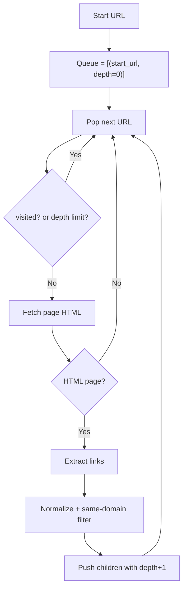
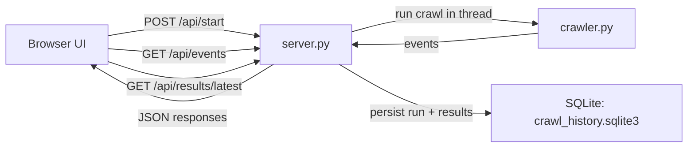
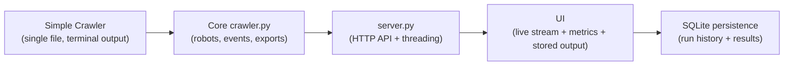

# Web Crawler Live

`Web Crawler Live` is a Python project for learning web crawling in two stages:

1. **Simple Crawler** (`simple_crawler/`) for core BFS concepts.
2. **Full App** (root files + UI) with live dashboard, APIs, and SQLite storage.

This repo uses only Python standard library modules.

## Learning Path

### Stage 1: Learn the Basics (Simple Crawler)

Use this first:

```bash
python3 simple_crawler/simple_crawler.py https://example.com --max-pages 10 --max-depth 1
```

It teaches:
- queue-based BFS crawl
- `visited` set deduplication
- depth-limited traversal
- HTML link extraction
- same-domain filtering

### Stage 2: Move to the Full App

Use this when you want:
- browser UI
- live event stream
- run history in SQLite
- API endpoints
- richer controls and metrics

Run full UI server from project root:

```bash
python3 -c "import os,sys,types,importlib.util; pkg=types.ModuleType('web_crawler_live'); pkg.__path__=[os.getcwd()]; sys.modules['web_crawler_live']=pkg; spec=importlib.util.spec_from_file_location('web_crawler_live.server', os.path.join(os.getcwd(),'server.py')); mod=importlib.util.module_from_spec(spec); sys.modules['web_crawler_live.server']=mod; spec.loader.exec_module(mod); mod.main()"
```

Open:
- `http://127.0.0.1:8000`

## Diagrams

### 1) Simple Crawler Flow (Teaching Version)



### 2) Full App Architecture



### 3) Progression Map: Simple to Full



## Project Structure

```text
web-crawler-live/
  README.md
  __init__.py
  crawler.py                      # Full crawler logic
  server.py                       # HTTP server + APIs + SQLite persistence
  crawl_history.sqlite3           # Auto-created DB for full app
  simple_crawler/
    README.md                     # Beginner notes for simple version
    simple_crawler.py             # Minimal teaching crawler
  ui/
    index.html                    # Full app dashboard
    static/
      app.js
      style.css
```

## Installation

### Prerequisites

- Python 3.9+

Check version:

```bash
python3 --version
```

### Clone

```bash
git clone <your-repo-url>
cd web-crawler-live
```

No external dependencies are required.

## Simple Crawler Details (`simple_crawler/`)

Run:

```bash
python3 simple_crawler/simple_crawler.py https://example.com --max-pages 10 --max-depth 1
```

Arguments:
- `start_url` required start point
- `--max-pages` max URLs to visit
- `--max-depth` max BFS depth
- `--timeout` HTTP timeout

Output:
- terminal lines like `[003] depth=1 https://example.com/page`

This version is intentionally basic:
- no UI
- no DB
- no API
- no robots.txt

## Full App Details

### Main Features

- UI controls for crawl settings
- live event stream (`start`, `visit`, `enqueue`, `skip`, `error`, `complete`)
- metrics cards (visited/queued/errors/skipped/depth)
- stored output table loaded from SQLite after crawl completion

### API Endpoints

- `POST /api/start` start crawl
- `GET /api/events?after=<id>` incremental event polling
- `GET /api/state` current in-memory session state
- `GET /api/results/latest` latest persisted run + results from SQLite

### Database Tables

- `crawl_runs`: one row per crawl run (settings, status, stats, timings)
- `crawl_results`: one row per visited page (`url`, `status`, `content_type`, `depth`)

### CLI Usage (Full crawler without UI)

```bash
python3 crawler.py https://example.com --max-pages 20 --max-depth 2
```

Export:

```bash
python3 crawler.py https://example.com --json-out crawl.json --csv-out crawl.csv
```

## Teaching Recommendation

1. Start with `simple_crawler/simple_crawler.py` and trace BFS behavior.
2. Move to `crawler.py` to understand production additions (robots/events/exports).
3. Move to `server.py` to learn API orchestration + threading + persistence.
4. Finally inspect `ui/static/app.js` for polling and live rendering.
